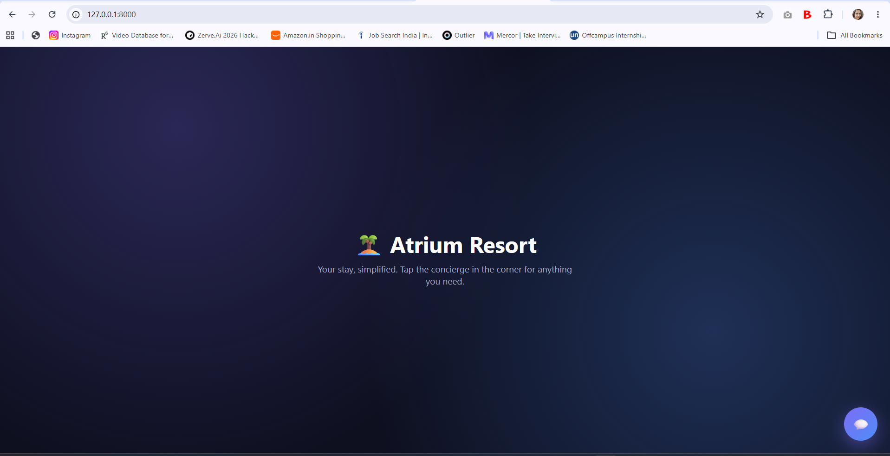
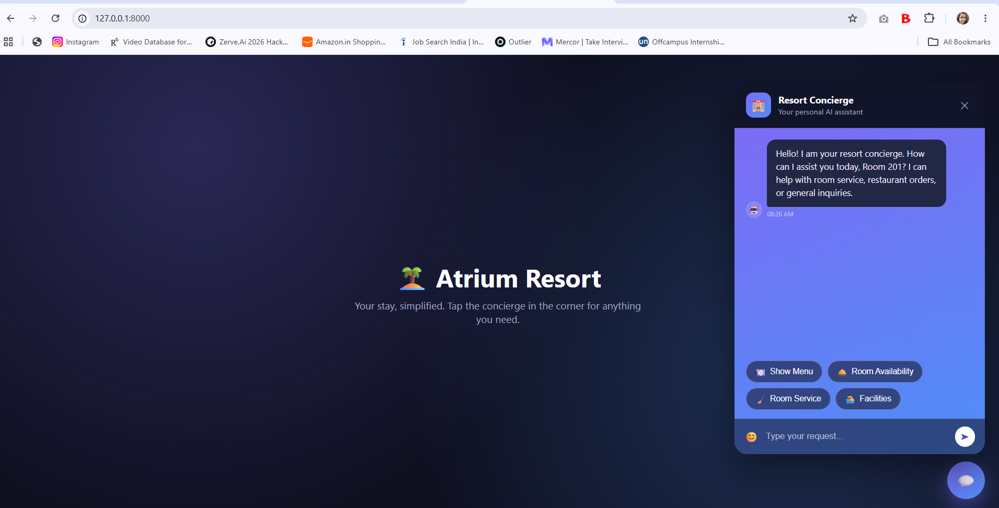
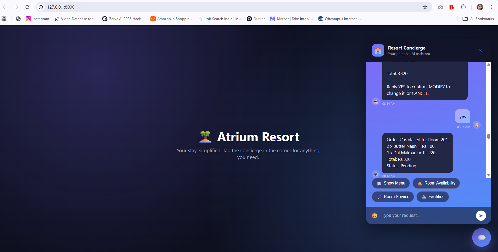
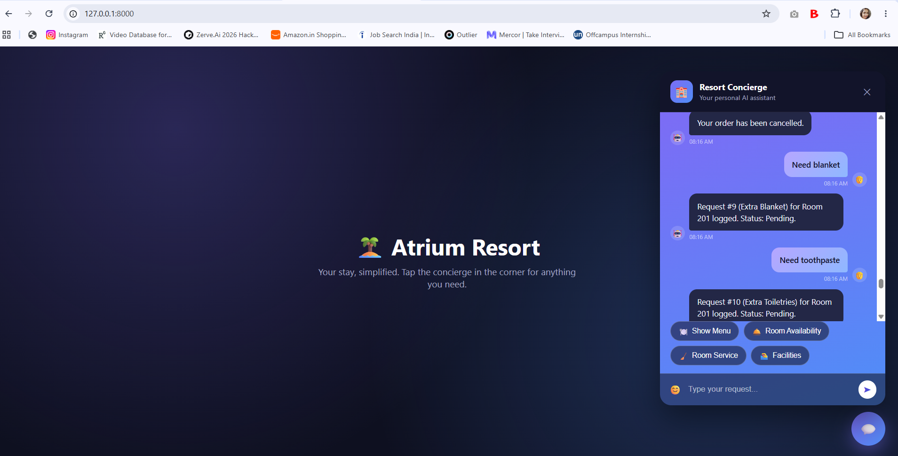
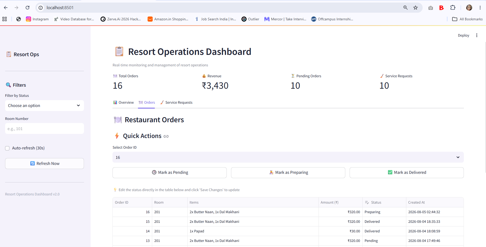

# 🏝️ Atrium AI Resort Concierge

<p align="center">


</p>

---

# 🏨 Overview

Atrium AI Resort Concierge is an end-to-end multi-agent hotel assistant that automates guest interactions using **Google Gemini**, **LangGraph**, **FastAPI**, and **SQLite**.

Guests can:

- 🍽 Order food naturally
- 🛎 Request room service
- 🏊 Ask about resort facilities
- 🏨 Check room availability
- 💬 Continue conversations across multiple messages

Meanwhile, hotel staff can monitor everything through a live Streamlit dashboard.

---

# 🚀 Features

## 🤖 AI Concierge

- Multi-agent routing
- Conversation memory
- Natural language understanding
- Multi-turn ordering
- Order confirmation
- Context-aware responses

---

## 🍽 Restaurant Assistant

- Browse menu
- Multi-turn ordering
- Add items over multiple messages
- Order confirmation
- Order status tracking
- Persistent SQLite storage

Example

```
Show menu

↓

2 Butter Naan

↓

1 Dal Makhani

↓

No

↓

YES

↓

Order Placed
```

---

## 🛎 Room Service

Supports

- Blanket
- Pillow
- Laundry
- Towels
- Toiletries
- Toothpaste
- Cleaning

All requests are stored in the database and shown on the dashboard.

---

## 🏨 Reception

Supports

- Check-in
- Check-out
- Gym
- Spa
- Swimming Pool
- Room Availability

---

## 📊 Live Dashboard

Built with Streamlit.

Features

- Live Food Orders
- Room Service Requests
- Revenue
- Order Status
- Pending Orders
- Interactive Charts

---

# 🧠 Conversation Memory

The chatbot remembers the current order.

Example

```
User:
2 Butter Naan

Bot:
Added.

User:
1 Dal Makhani

Bot:
Added.

User:
No

Bot:
Please confirm your order.

User:
YES

Bot:
Order placed.
```

---

# 🏗 Architecture

```
                    Guest Chat Widget
                           │
                           ▼
                   FastAPI Backend
                           │
                           ▼
                LangGraph Supervisor
          ┌──────────┬──────────────┬───────────┐
          ▼          ▼              ▼
   Reception     Restaurant    Room Service
          │          │              │
          └──────────┴──────────────┘
                     │
                     ▼
               SQLite Database
                     │
                     ▼
            Streamlit Dashboard
```

---

# 🛠 Tech Stack

### Backend

- FastAPI
- LangGraph
- LangChain
- Google Gemini
- SQLAlchemy

### Frontend

- HTML
- CSS
- JavaScript

### Dashboard

- Streamlit
- Plotly

### Database

- SQLite

---

# 📂 Project Structure

```
atrium_resort_ai/

backend/
frontend/
data/
dashboard.py
requirements.txt
README.md
```

---

# ⚙ Installation

Clone

```bash
git clone https://github.com/<username>/atrium_resort_ai.git
```

Install

```bash
pip install -r requirements.txt
```

Create

```
.env
```

```
GOOGLE_API_KEY=YOUR_API_KEY
GEMINI_MODEL=gemini-2.5-flash
```

Seed Database

```bash
python -m backend.seed
```

Run Backend

```bash
uvicorn backend.main:app --reload
```

Run Dashboard

```bash
streamlit run dashboard.py
```

---

# 📸 Screenshots

## 🏠 Landing Page

> *(Add screenshot here)*



---

## 💬 AI Concierge

> *(Add screenshot here)*



---

## 🍽 Multi-turn Ordering

> *(Add screenshot here)*



---

## 🛎 Room Service

> *(Add screenshot here)*



---

## 📊 Dashboard

> *(Add screenshot here)*



---

# 🎥 Demo

*(Add deployed website URL here after deployment)*

Live Demo

```
https://your-app-url.com
```

---

# 🌟 Resume Highlights

✔ Multi-Agent AI Architecture

✔ LangGraph Workflow

✔ Google Gemini Integration

✔ FastAPI REST Backend

✔ Conversation Memory

✔ Multi-turn Ordering

✔ SQLite Persistence

✔ Interactive Dashboard

---

# 🚧 Future Roadmap

- Voice Concierge
- Spa Booking
- Taxi Booking
- Airport Pickup
- Wake-up Calls
- Restaurant Reservation
- Bill Generation
- PostgreSQL
- Redis Memory
- Docker
- Kubernetes

---

# 👩‍💻 Author

**Shruti Agarwal**

M.Tech, IIT Kharagpur

LinkedIn

https://www.linkedin.com/in/shruti2803/

GitHub

https://github.com/Avisha2803

---

# 📄 License

This project is licensed under the MIT License.